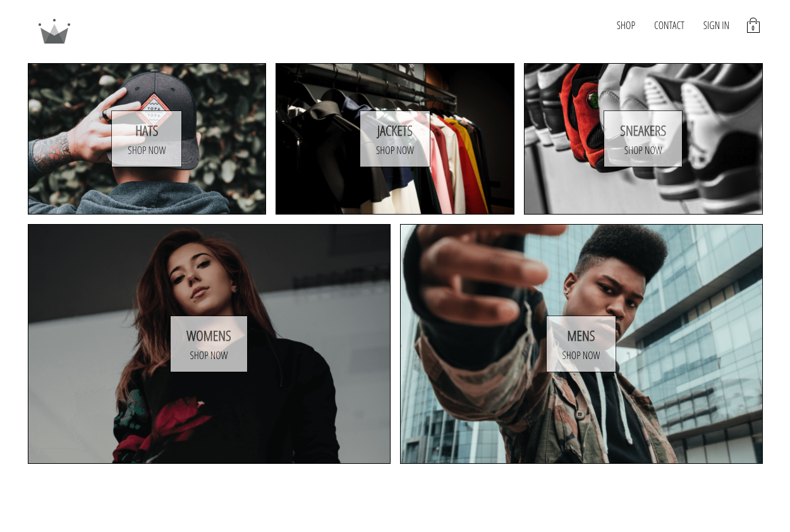

  <a href="#wave-intros">Intros</a>&nbsp;&nbsp;&nbsp;|&nbsp;&nbsp;&nbsp;
  <a href="#muscle-motivation">Motivation</a>&nbsp;&nbsp;&nbsp;|&nbsp;&nbsp;&nbsp;
  <a href="#gear-core-tech-stack">Tech Stack</a>&nbsp;&nbsp;&nbsp;|&nbsp;&nbsp;&nbsp;
  <a href="#calling-main-features">Features</a>&nbsp;&nbsp;&nbsp;|&nbsp;&nbsp;&nbsp;
  <a href="#memo-license-">License</a>&nbsp;&nbsp;&nbsp;|&nbsp;&nbsp;&nbsp;
  <a href="#warning-disclaimer">Disclaimer</a>

# **👑 CRWN APPAREL** 

 

## :wave: Intros!
👉&nbsp; **[Live Preview](https://crwn-aprl.herokuapp.com/ "CRWN APPAREL")**

CRWN Apparel is an e-commerce clothing and accessories website with common features that resembles a modern-day e-commerce platform. Users can sign up for their very own account on the website and add any of the available items to their shopping cart for checkout.

Note: **As CRWN Apparel is not an actual commerical business, payments charged at checkout on the website are for testing purposes only and are _NOT REAL_ payments! For this, a test credit-card by Stripe has been provided at the checkout page for users to try out the payment processing of the application.**

FYI: _**If you would like to try out the application but do not wish to manually sign up or sign in using your own Google account, you can use the provided test account below.**_

* Email: **testuser@gmail.com** &nbsp;:e-mail:
* Password: **YKU@Du$EHeY6** &nbsp;:closed_lock_with_key:

## :muscle: Motivation
In an effort to further improve my skills as a software engineer working with the React library, I wanted to build an application that would mimic a development environment in a professional capacity. As every development experience and workflow is unique in itself in both personal & professional work projects, the main goal here was to build something that a developer would commonly encounter when working in professional projects and to contribute a fully fleshed-out & working project to my professional portfolio.

This lead me to the idea of creating an e-commerce application that carries the common features of modern web applications, such as user account creation and login, a customizable shopping cart unique to each user, checkout functionality such as payments and more. To ensure the best development and learning experience while building out this project, the choice to go for an e-commerce website was motivated by the widely-available support for building such applications as e-commerce platforms developed using React are a commonality in software development.     

## :gear: Core Tech Stack
* :electron:&nbsp; React
* :atom:&nbsp; Redux w/ Saga
* :link:&nbsp; React Router
* :performing_arts:&nbsp; Styled Components
* :fire:&nbsp; Firebase Cloud Firestore
* :credit_card:&nbsp; Stripe Payment API
* :electric_plug:&nbsp; ExpressJS

## :calling: Main Features 
* Sign In & Sign Up authentication through email & password or Google. 
* Customizable and persistable shopping cart unique to each user.
* Payment processing and authentication through Stripe. _**(A test Visa credit card by Stripe is provided)**_
* Responsive page layouts that fits and align nicely on both mobile _**(800px and below)**_ and desktop view.
* A Progressive Web Application **(PWA)** that enhances overall user experience on both desktop and mobile devices.

## :memo: License 
This project is licensed under the terms of the MIT license. For more information, please refer to the license [documentation](LICENSE.md).

## :warning: Disclaimer
The contents of these pages are provided as an information guide only. While every effort is made in preparing the material for publication, no responsibility is accepted by or on behalf of the owner(s) for any errors, omissions or misleading statements on these pages or any site to which these pages connect. Although every effort is made to ensure the reliability of listed sites this cannot be taken as an endorsement of these sites.